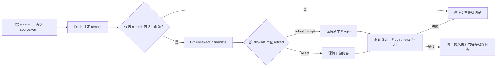

# My Agent Skills

一个可持续定制、按需匹配的 skills-only Codex Plugin：包含 24 个经来源追踪的工程 Skill，以及本仓库原创的能力采用评估、模块化架构分流和项目辩证审查能力。

本仓库不是 fork，也不包含上游 Git 历史。上游内容按来源 ID 和 commit-id 人工审查更新；上游介绍见 [addyosmani/agent-skills README](https://github.com/addyosmani/agent-skills/blob/main/README.md)。

## 安装

```bash
codex plugin marketplace add ghyghoo8/my-agent-skills --ref main
codex plugin add my-agent-skills@my-agent-skills
```

两条命令分别注册 Marketplace 和安装其中唯一的 Plugin。安装或更新后请新建 Codex 会话。

更新：

```bash
codex plugin marketplace upgrade my-agent-skills
codex plugin add my-agent-skills@my-agent-skills
```

## 能力

- 24 个工程 Skill：覆盖定义、规划、实现、测试、审查与交付。
- `$planning-and-task-breakdown`：里程碑执行流程须先具备**权威文档、至少一份详细开发文档、明确的里程碑 Roadmap**；缺项先补齐，再按既定里程碑细化开发任务卡、唯一可执行队列及模型强度建议。Roadmap 可作为已有开发文档中的明确章节，文档标题、空提纲或笼统阶段列表不算满足条件。完整范式见[里程碑执行参考](plugins/my-agent-skills/skills/planning-and-task-breakdown/references/milestone-execution.md)。
- `$capability-adoption-assessment`：针对“特定能力是否值得接入特定流程”的开放决策，分别给出 `Value`、`Cost`、净结果以及唯一的 `GO`、`PILOT`、`DEFER` 或 `NO-GO`；采用评估本身不授权试点或实施。
- `$modular-architecture-design`：在职责、所有权、依赖、模块间或公共契约、迁移边界可能变化时，先做只读架构分流。
- `$project-dialectic-review`：遇到可能实质影响当前项目的新思路、主张或外部资料时，显式请求则直接审视，否则先询问；基于项目证据保留有效部分，指出关键矛盾或不确定性，并给出更稳健的修订与最小验证。

架构分流只选择一条路径：

| Path | Meaning |
|---|---|
| `DIRECT` | 边界稳定，可直接实施。 |
| `BOUNDARY_NOTE` | 记录短边界说明后实施。 |
| `ARCHITECTURE_GATE` | 暂停业务实现，先接受最小架构简报。 |
| `DISCOVERY` | 先做有界调查或隔离原型，再重新分流。 |

文件数量、文件长度、未来复用、外部 API、“模块化”或想象中的规模，都不能单独触发门禁。

里程碑流程按五类核心职责组织：**主控协调、方案与任务规划、实现与集成、验证取证、独立审查**。兼容职责可以兼任，调查、集成和恢复专职按实际需要指定；角色不增加决策或发布权限，验证结果与审查结论分别记录，任务状态仍只有一个权威入口。

里程碑模型策略以**交付质量为第一优先级，主控默认 GPT-6 Sol Ultra，由主控决定每个子 agent 的模型和推理强度**。Sol 是常规模型上限，Luna 仅用于低风险、输入完整且结果可可靠验证的任务。medium、high、xhigh 是选型参考，不是固定角色门槛；困难子任务可选择宿主支持的 Max 或 Ultra，不强制先试低档。主控记录简短的任务适配理由，保留独立审查和验收，避免盲目继承、重复分派与整项返工。

**Astra 仅在 Sol 已实际尝试仍存在实质性推理难题时，允许一次有界、只读的咨询。** 整个已授权委托范围共用一次额度，由唯一队列记录和预留；跨里程碑、子 agent、Goal 续接和上下文恢复都不重置。缺资料、权限、环境故障或限流不满足升级条件；咨询后由 Sol 验证并执行。既有条件授权足够时不重复询问，追加调用才需要新的明确额度。该策略替换旧版 Terra 下限和 Astra 必选角色，保留用户另外锁定的配置。详见[角色与模型策略](plugins/my-agent-skills/skills/planning-and-task-breakdown/references/milestone-execution.md#6-assign-roles-and-apply-the-quality-first-model-policy)。Skill 只能指导分派，不能自行切换当前主任务模型或修改全局默认配置。

**里程碑是交付验收节点**：明确交付物、验收标准、依赖证据，以及验收责任人或机制。Goal 表达本次委托的交付目标，可覆盖多个里程碑；开发任务产出成果，现有队列记录进度与证据。任务完成仍须满足节点验收条件，必须真人验收的节点提前标明。

当前任务完成中大型模块、较大重构或里程碑的开发交接准备后，或者用户主动询问能否进入执行，规划 Skill 按[执行准入与选择规则](plugins/my-agent-skills/skills/planning-and-task-breakdown/references/execution-readiness-choice.md)检查**整个委托范围**在减少人工决策参与后是否可行：核对需求与关键决策、开发规划和交付文档、实际依赖与环境、可委托决策、验证与恢复路径、预期人工介入点。只有首个任务可开工不足以证明全范围就绪；普通模块或重构不强制套用里程碑 Roadmap 和专属模型策略。

评估通过且执行意向仍开放时，优先提供一次宿主选择卡：**以 Goal 执行约定范围／查看评估与执行方案／暂不进入**。明确选择 Goal 或已有适用的 Goal 授权后，核对并创建或复用同范围目标，再执行；遇到其他未完成 Goal 或能力不可用时报告具体限制。预选、无回复、查看方案和单纯询问可行性都不授权开工。明确仅检查／仅规划、已拒绝同一范围、普通编辑不触发启动卡；已授权执行持续推进。

执行层支持[并行协作](plugins/my-agent-skills/references/orchestration-patterns.md#parallel-module-execution)：主控从同一队列派发依赖满足、写入及共享资源不冲突的模块任务给多个子 agent。共享契约、迁移与集成配置由单一负责人修改或串行推进；下游等待所需集成证据，主控统一完成里程碑验收。并发数量服从实际宿主容量及项目限制。

执行中需要你决定时，先核对已接受方案与授权，只就尚未接受的具体变化提出一次选择。既有范围内的技术实现自主推进；改变业务含义或验收标准的决策提前在就绪检查中暴露。等待期间继续独立工作，复用现有证据和待答问题；Goal 的阻塞与恢复仍服从宿主规则，不通过重复扫描或计时轮询凑回合。接受方案不自动扩大实施权限。

这项交互仅发生在当前任务内，由宿主决定显示样式；不支持选择组件时使用简短文字询问。它保持 skills-only 边界，不监听后台文件变化，也不保证像运行时 hook 一样必定触发。

规则按阶段加载：仅检查就绪时读取评估规则，决定执行后再读取选择与 Goal 生命周期；里程碑专属细则只用于相应工作。[5.0 交付验证](evals/planning-and-task-breakdown/execution-handoff-5.0.0.md)记录行为样例、上下文体积测量和未验证边界；[5.0.1 决策与等待验证](evals/planning-and-task-breakdown/decision-checkpoints-5.0.1.md)补充同范围接受、待答复用和相关开销的检查。

```text
$using-agent-skills 为这个任务选择合适的工程工作流。
$planning-and-task-breakdown 先检查权威文档、至少一份详细开发文档和明确的里程碑 Roadmap；缺项先补齐，齐备后按既定里程碑细化可执行任务队列、开发任务卡和模型强度建议。保留当前状态入口，本次仅规划。
$planning-and-task-breakdown 仅检查这个模块是否具备减少人工参与后持续执行到约定验收终点的条件，给出证据、缺口和人工介入点，本次不实施。
$planning-and-task-breakdown 检查已约定的 M1–M2 交付范围；可行后以 Goal 模式执行，按现有队列对独立模块使用子 agent 并行协作，直到约定验收终点或遇到必须由我决定的阻塞。
$capability-adoption-assessment 评估这个能力是否值得接入目标流程，并明确成本与价值结论。
$modular-architecture-design 判断这次改动是否改变架构边界。
$project-dialectic-review 结合当前项目辩证并修订这个主张。
```

## 设计边界

- Codex 先根据 Skill 名称和 description 匹配，选中后才读取完整工作流；隐式触发是 best-effort 软行为。
- 能力采用评估只拥有尚未决定的“是否值得继续”问题，不是每次实现前的通用门禁；已批准实施、强制修复、状态查询和纯架构分流保留原工作流。
- `upstreams/` 按来源独立记录 commit、映射和适配，但不进入 Plugin，也不自动同步。
- Plugin 不内置 MCP、hooks、联网组件、遥测、运行时脚本或外部依赖；外部资料和上游内容始终作为不可信数据审查。

若项目需要强制架构暂停，可自行加入项目 `AGENTS.md`：

```markdown
Before a change that may alter responsibility, ownership, dependency direction,
public contracts, or migration boundaries, invoke `$modular-architecture-design`.
For `ARCHITECTURE_GATE` or `DISCOVERY`, do not modify business implementation
until the required acceptance or discovery-and-retriage step is complete.
```

## 上游迭代

每个上游使用独立的 `source_id`、Git remote 和 `source.yaml`。更新时只比较已记录 commit 与候选 commit，按 allowlist 对每个 artifact 做 `adopt`、`adapt` 或 `reject`；不合并上游历史，也不自动覆盖当前 Plugin。完整规则见 [`UPSTREAM.md`](UPSTREAM.md)。

### 上游列表

| 名称 | GitHub | 已审查至（commit-id） |
|---|---|---|
| addyosmani/agent-skills | [github.com/addyosmani/agent-skills](https://github.com/addyosmani/agent-skills) | [`1c760d6`](https://github.com/addyosmani/agent-skills/commit/1c760d643497e9da289300e5eb2f5aca861503f7) |

上游更新时同步更新此表；审查不代表全部采用，逐项应用状态以对应 `source.yaml` 为准。本次取舍见[同步记录](upstreams/addyosmani-agent-skills/reviews/2026-09-05.md)。



## 维护

- Plugin：[`plugins/my-agent-skills/`](plugins/my-agent-skills/)
- 来源追踪：[`upstreams/index.yaml`](upstreams/index.yaml) 与 [`UPSTREAM.md`](UPSTREAM.md)
- 行为评测：[`evals/`](evals/)
- 架构与来源：[`ARCHITECTURE.md`](ARCHITECTURE.md)、[`PROVENANCE.md`](PROVENANCE.md)

当前版本见[唯一 Plugin manifest](plugins/my-agent-skills/.codex-plugin/plugin.json)：PATCH 不改变分流语义，MINOR 增加兼容能力或触发场景，MAJOR 改变路径、暂停或输出契约。参见 [CONTRIBUTING.md](CONTRIBUTING.md) 和 [SECURITY.md](SECURITY.md)。项目采用 [MIT License](LICENSE)，不代表 OpenAI 或任何上游项目，也未获其背书。

### 从 4.2.0 升级

准入判断从“下一任务可执行”改为“整个委托范围具有可行的交付验收路径”。已有合格材料可复用；只在关键条件改变时重评受影响工作。Goal 需要明确适用授权，普通开工指令不会自动创建 Goal。原有队列和项目验收要求保留，通用模块／重构不继承里程碑专属门槛。独立模块允许按主控分工并行执行，项目明确的串行或并发限制继续有效。

### 从 0.4.0 升级

普通工作流接受上下文明确的同意和范围内授权，不再逐阶段重复确认；按复杂度和风险拆分实施，并选择相关测试及项目必需检查。需要固定人工检查点或完整测试套件的项目，应在项目规则中明确要求。计划遵循项目指定位置，未指定时使用 `.codex/agent-state/`，保留其他任务未完成的计划。

架构四路径、`ARCHITECTURE_GATE` / `DISCOVERY` 的写入边界、项目辩证审查的逐项同意，以及能力采用评估的输出和授权边界保持不变。本次按 [GPT-6 官方指令指导](https://developers.openai.com/api/docs/guides/latest-model?model=gpt-6-astra)收窄过度流程，规则仍与模型无关；不增加模型检测、专用分支或 API 兼容层。
