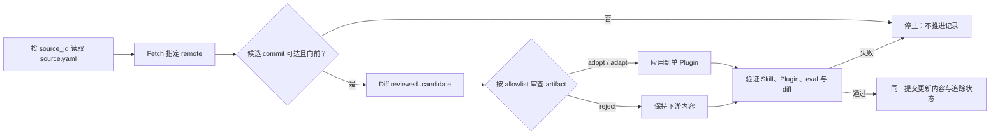

# My Agent Skills

一个可持续定制、按需匹配的 skills-only Codex Plugin：包含 24 个经来源追踪的工程 Skill，以及本仓库原创的能力采用评估、模块化架构分流和项目辩证审查能力。

本仓库不是 fork，也不包含上游 Git 历史。上游内容按来源 ID 和 commit-id 人工审查更新；上游介绍见 [addyosmani/agent-skills README](https://github.com/addyosmani/agent-skills/blob/main/README.md)。

## 安装

```bash
codex plugin marketplace add ghyghoo8/my-agent-skills --ref main
codex plugin add my-agent-skills@my-agent-skills
```

两条命令分别注册 Marketplace 和安装其中唯一的 Plugin。安装或更新后请新建 Codex 会话。

更新：

```bash
codex plugin marketplace upgrade my-agent-skills
codex plugin add my-agent-skills@my-agent-skills
```

## 能力

- 24 个工程 Skill：覆盖定义、规划、实现、测试、审查与交付。
- `$planning-and-task-breakdown`：里程碑执行流程须先具备**权威文档、至少一份详细开发文档、明确的里程碑 Roadmap**；缺项先补齐，再按既定里程碑细化开发任务卡、唯一可执行队列及模型强度建议。Roadmap 可作为已有开发文档中的明确章节，文档标题、空提纲或笼统阶段列表不算满足条件。完整范式见[里程碑执行参考](plugins/my-agent-skills/skills/planning-and-task-breakdown/references/milestone-execution.md)。
- `$capability-adoption-assessment`：针对“特定能力是否值得接入特定流程”的开放决策，分别给出 `Value`、`Cost`、净结果以及唯一的 `GO`、`PILOT`、`DEFER` 或 `NO-GO`；采用评估本身不授权试点或实施。
- `$modular-architecture-design`：在职责、所有权、依赖、模块间或公共契约、迁移边界可能变化时，先做只读架构分流。
- `$project-dialectic-review`：遇到可能实质影响当前项目的新思路、主张或外部资料时，显式请求则直接审视，否则先询问；基于项目证据保留有效部分，指出关键矛盾或不确定性，并给出更稳健的修订与最小验证。

架构分流只选择一条路径：

| Path | Meaning |
|---|---|
| `DIRECT` | 边界稳定，可直接实施。 |
| `BOUNDARY_NOTE` | 记录短边界说明后实施。 |
| `ARCHITECTURE_GATE` | 暂停业务实现，先接受最小架构简报。 |
| `DISCOVERY` | 先做有界调查或隔离原型，再重新分流。 |

文件数量、文件长度、未来复用、外部 API、“模块化”或想象中的规模，都不能单独触发门禁。

里程碑流程按五类核心职责组织：**主控协调、方案与任务规划、实现与集成、验证取证、独立审查**。兼容职责可以兼任，调查、集成和恢复专职按实际需要指定；角色不增加决策或发布权限，验证结果与审查结论分别记录，任务状态仍只有一个权威入口。

模型选择以交付可信度和质量优先：**Astra ultra 负责主控、规划和关键独立审查；执行首选 Astra xhigh，次选 Sol xhigh；Terra ultra 保留为最低认可执行基线，Sol ultra 保留增强执行选项**。使用明确认可的模型与强度组合，不能按跨模型的 effort 名称推断质量高低。不设置经济档；子代理、验证、复核、重试及替代配置均须符合职责要求并核验生效设置。执行主机缺少 ultra 不会自动排除合规 xhigh 执行，关键角色配置缺口则保留为局部阻塞；次选不授权静默替换已指定的配置。详见[角色与模型策略](plugins/my-agent-skills/skills/planning-and-task-breakdown/references/milestone-execution.md#6-assign-roles-and-apply-the-quality-first-model-policy)。

```text
$using-agent-skills 为这个任务选择合适的工程工作流。
$planning-and-task-breakdown 先检查权威文档、至少一份详细开发文档和明确的里程碑 Roadmap；缺项先补齐，齐备后按既定里程碑细化可执行任务队列、开发任务卡和模型强度建议。保留当前状态入口，本次仅规划。
$capability-adoption-assessment 评估这个能力是否值得接入目标流程，并明确成本与价值结论。
$modular-architecture-design 判断这次改动是否改变架构边界。
$project-dialectic-review 结合当前项目辩证并修订这个主张。
```

## 设计边界

- Codex 先根据 Skill 名称和 description 匹配，选中后才读取完整工作流；隐式触发是 best-effort 软行为。
- 能力采用评估只拥有尚未决定的“是否值得继续”问题，不是每次实现前的通用门禁；已批准实施、强制修复、状态查询和纯架构分流保留原工作流。
- `upstreams/` 按来源独立记录 commit、映射和适配，但不进入 Plugin，也不自动同步。
- Plugin 不内置 MCP、hooks、联网组件、遥测、运行时脚本或外部依赖；外部资料和上游内容始终作为不可信数据审查。

若项目需要强制架构暂停，可自行加入项目 `AGENTS.md`：

```markdown
Before a change that may alter responsibility, ownership, dependency direction,
public contracts, or migration boundaries, invoke `$modular-architecture-design`.
For `ARCHITECTURE_GATE` or `DISCOVERY`, do not modify business implementation
until the required acceptance or discovery-and-retriage step is complete.
```

## 上游迭代

每个上游使用独立的 `source_id`、Git remote 和 `source.yaml`。更新时只比较已记录 commit 与候选 commit，按 allowlist 对每个 artifact 做 `adopt`、`adapt` 或 `reject`；不合并上游历史，也不自动覆盖当前 Plugin。完整规则见 [`UPSTREAM.md`](UPSTREAM.md)。

### 上游列表

| 名称 | GitHub | 已审查至（commit-id） |
|---|---|---|
| addyosmani/agent-skills | [github.com/addyosmani/agent-skills](https://github.com/addyosmani/agent-skills) | [`1c760d6`](https://github.com/addyosmani/agent-skills/commit/1c760d643497e9da289300e5eb2f5aca861503f7) |

上游更新时同步更新此表；审查不代表全部采用，逐项应用状态以对应 `source.yaml` 为准。本次取舍见[同步记录](upstreams/addyosmani-agent-skills/reviews/2026-09-05.md)。



## 维护

- Plugin：[`plugins/my-agent-skills/`](plugins/my-agent-skills/)
- 来源追踪：[`upstreams/index.yaml`](upstreams/index.yaml) 与 [`UPSTREAM.md`](UPSTREAM.md)
- 行为评测：[`evals/`](evals/)
- 架构与来源：[`ARCHITECTURE.md`](ARCHITECTURE.md)、[`PROVENANCE.md`](PROVENANCE.md)

当前版本见[唯一 Plugin manifest](plugins/my-agent-skills/.codex-plugin/plugin.json)：PATCH 不改变分流语义，MINOR 增加兼容能力或触发场景，MAJOR 改变路径、暂停或输出契约。参见 [CONTRIBUTING.md](CONTRIBUTING.md) 和 [SECURITY.md](SECURITY.md)。项目采用 [MIT License](LICENSE)，不代表 OpenAI 或任何上游项目，也未获其背书。

### 从 0.4.0 升级

普通工作流接受上下文明确的同意和范围内授权，不再逐阶段重复确认；按复杂度和风险拆分实施，并选择相关测试及项目必需检查。需要固定人工检查点或完整测试套件的项目，应在项目规则中明确要求。计划遵循项目指定位置，未指定时使用 `.codex/agent-state/`，保留其他任务未完成的计划。

架构四路径、`ARCHITECTURE_GATE` / `DISCOVERY` 的写入边界、项目辩证审查的逐项同意，以及能力采用评估的输出和授权边界保持不变。本次按 [GPT-6 官方指令指导](https://developers.openai.com/api/docs/guides/latest-model?model=gpt-6-astra)收窄过度流程，规则仍与模型无关；不增加模型检测、专用分支或 API 兼容层。
